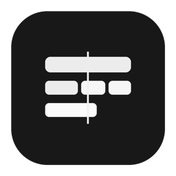
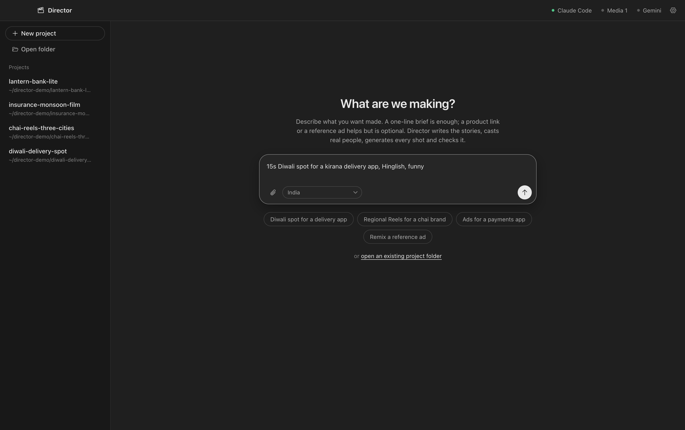

<p align="center">
  
</p>

<h1 align="center">Director</h1>

<p align="center">
  <b>Your AI ad-film studio.</b><br />
  Type a one-line brief. Get finished ads: the story, a cast that looks real, every shot, the motion graphics and the end card.
</p>

<p align="center">macOS · Free and open source (MIT) · Runs on your own Claude Code</p>



## What Director does

**From one line to a finished ad.** "15s Diwali spot for a kirana delivery app, Hinglish, funny" is enough. Director writes a few concepts on one insight, casts them, generates every shot through your media model, checks each take and hands back with-text and clean cuts, the prompts and a zip.

**Looks real, not AI.** Ordinary-looking people of every age, region and skin tone, written with dignity. Real places with honest clutter. Sync dialogue in the language's own script. Every take is checked frame by frame and re-rolled when hands melt, faces drift or invented text appears.

**Speaks your market.** Pick the market for each project: **India** (Hindi, Hinglish and regional languages, Indian story archetypes, festivals and ad norms), **US & UK**, **Europe**, **Middle East & Africa**, **Southeast Asia**, or several at once.

**You have the last word.** Everything Director makes lands on a timeline you can edit:
- double-click any callout or card on the video and retype it;
- drag it to a new spot on screen, or retime it on the timeline;
- set any Google Font for the lettering and the cards;
- swap in another take, then **Save and render**.

**End cards that fit the brand.** Director asks how the ad should end, or matches an image you attach, using your logo, packshots and font. Pick offer-led, packshot, kinetic type, product hero, festive or app UI, so every ad can end differently.

**Your accounts, your models.** Director drives your own Claude Code (your Claude login or an API key) and whichever media MCP you connect: AI Studio, Higgsfield, fal, Replicate or your own. A Gemini check can give a second opinion on every take.

**A studio, not a terminal.** The chat, the viewer and the files sit side by side:
- each project keeps its conversation;
- a follow-up you type mid-run waits its turn;
- long steps show how long they've been running;
- every file is one click from Finder.

## Get started

1. **Build the app** (a Mac with Apple Silicon):
   ```bash
   git clone https://github.com/pranikz/Ad-Director && cd Ad-Director/app
   npm install && npm run dist        # → dist/Director-darwin-arm64/Director.app
   ```
   Move `Director.app` to Applications. To run it from source instead: `npm start`.
2. **Open Director.** Setup:
   - connects Claude Code;
   - checks ffmpeg, Node.js, Python and uv, and installs any that are missing through Homebrew in one click;
   - connects a media MCP and, if you want it, Gemini.
3. **Type a brief**, pick the market and press Enter.


## How a film gets made

| Step | What Director does |
|---|---|
| **Brief** | Reads your brief, product page or reference ad. Asks only what changes the work; exact claims are never guessed. |
| **Stories** | A few concepts on one insight, each with a specific place, a varied cast and a payoff line. |
| **Cast and plates** | Casting written in words, plus people-free location photos as image references. |
| **Films** | Multi-shot prompts with sync dialogue, quoted first, then generated in parallel. |
| **QA** | Contact sheets, a transcript check, physics and casting checks, and targeted re-rolls. |
| **Graphics** | Hand-lettered or kinetic callouts and UI cards, placed inside shots and clear of faces. |
| **End card and delivery** | Your end card, with-text and clean cuts, every prompt and a zip. |

## Use it in Claude Code, without the app

Director is also a Claude Code plugin. It has:
- the `director` agent, for India;
- the `director-international` agent, for other markets;
- the `direct-film` skill: playbooks, scripts, HyperFrames templates and a worked example.

```bash
claude plugin marketplace add pranikz/Ad-Director
claude plugin install director@director
claude --agent director:director
```

Media backends work the same way in both:
- **AI Studio MCP:** runs locally with `uvx` and needs an AI Studio account. It includes a fast parallel runner.
- **Higgsfield MCP:** hosted, signed in through Claude Code. Add it with `claude mcp add --transport http --scope user higgsfield https://mcp.higgsfield.ai/mcp`.
- **Anything else** (fal, Replicate, your own): add it in Claude Code's `mcpServers` format.

## Requirements
- A Mac with Apple Silicon, for the app.
- Claude Code 2.1+.
- ffmpeg, Node.js 18+, Python 3 and uv. The app checks these and installs any that are missing.
- An account with a media MCP.
- A Gemini key (optional).

## Contributing
New markets are the most useful contribution: add `plugins/director/skills/direct-film/references/locales/<market>.md` in the same shape as `india.md`. Bug fixes, doodles and end-card styles are welcome too.

## Responsible use
- You're responsible for what you generate and publish: claims, disclaimers, likeness and local ad rules. The playbooks flag the common ones, but they aren't legal advice.
- No celebrity likenesses. Director casts fictional people and won't imitate real ones.
- Not affiliated with Anthropic, OpenAI, Google, Higgsfield or any media provider.

## License
[MIT](LICENSE) © 2026 Pratyush Mahapatra · [pranikz.dev](https://pranikz.dev)
