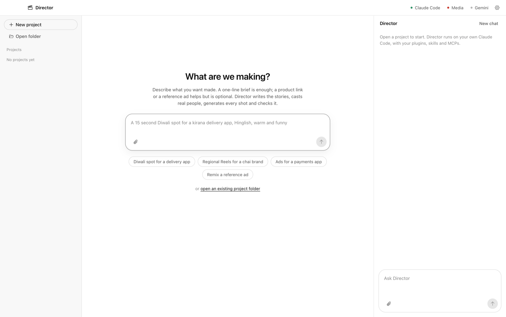
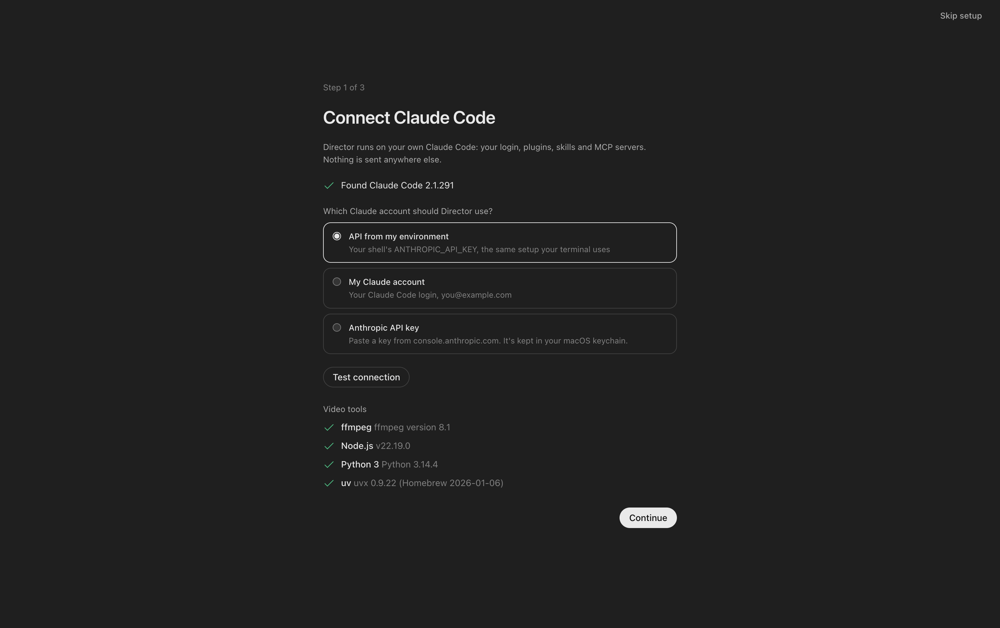

# Director

**An AI ad-film director for Claude Code.** You give it a brief (a single line is enough), and optionally a product link or a reference ad. It writes the stories, casts people who look real, generates every shot through your media MCP, checks each take like a picky director, adds hand-lettered motion graphics and hands back finished ads.

It's India-first: Hindi, Hinglish and regional languages, with Indian story archetypes, casting and compliance norms. An international agent covers other markets.



Two parts, one repo:

| | What it is |
|---|---|
| [`plugins/director`](plugins/director) | A Claude Code plugin: the `director` agent (India), the `director-international` agent, and the `direct-film` skill (phased workflow, playbooks, scripts, HyperFrames templates, a worked example). Works in any Claude Code. |
| [`app`](app) | A desktop studio (Electron) that drives **your own Claude Code** with the plugin. It adds onboarding, media MCP connections, a viewer, an editable timeline and optional Gemini VLM checks. |

## How it works
1. **Brief:** the claims, language, tone, formats and any reference ad.
2. **Stories:** the agent picks a device (pun, human truth, tension, ritual) and writes N concepts, each with a specific place, a varied cast and a payoff line.
3. **Cast and plates:** casting briefs in text, plus people-free location plates as image references.
4. **Films:** multi-shot prompts with sync dialogue in the native script, generated in parallel.
5. **QA:** dense contact sheets, a transcript diff, physics and casting checks, and re-rolls with targeted fixes.
6. **Graphics:** hand-lettered callouts, doodles and UI cards, placed inside shots and clear of faces. HyperFrames renders them as a transparent overlay.
7. **End card and delivery:** a brand end card from JSON, with-text and clean cuts, prompts and a zip.

## Quick start
**Plugin only (any Claude Code):**
```bash
claude plugin marketplace add /path/to/director
claude plugin install director@director
claude --agent director:director
```
**Desktop app:**
```bash
cd app && npm install && npm start      # or: npm run dist, which builds a macOS .app with the plugin inside
```
The first run walks you through connecting Claude Code, a media MCP and, optionally, Gemini.



## Media backends
Director works with any media-generation MCP server. Built-in setups:
- **AI Studio MCP** (stdio via `uvx`, needs an AI Studio account). It includes a fast parallel runner (`scripts/run.py`).
- **Higgsfield MCP** (hosted, OAuth through Claude Code): `claude mcp add --transport http --scope user higgsfield https://mcp.higgsfield.ai/mcp`.
- **Anything else** (fal, Replicate, your own) in Claude Code's `mcpServers` format.

## Requirements
Claude Code 2.1+, `ffmpeg`, Node 18+ (HyperFrames renders via `npx hyperframes`), `uv` for the AI Studio runner. A `GEMINI_API_KEY` is optional.

## Contributing
New locales are the most useful contribution: `plugins/director/skills/direct-film/references/locales/<market>.md`, in the same shape as `india.md`. Bug fixes and new doodles or templates are welcome too.

## Notes
- You are responsible for what you generate and publish: claims, disclaimers, likeness and local ad rules. The playbooks flag the common ones; they are not legal advice.
- No celebrity likenesses. The prompts cast fictional people and the skill forbids imitating real ones.
- Not affiliated with Anthropic, OpenAI, Google, Higgsfield or any media provider.

## License
[MIT](LICENSE) © 2026 Pratyush Mahapatra
